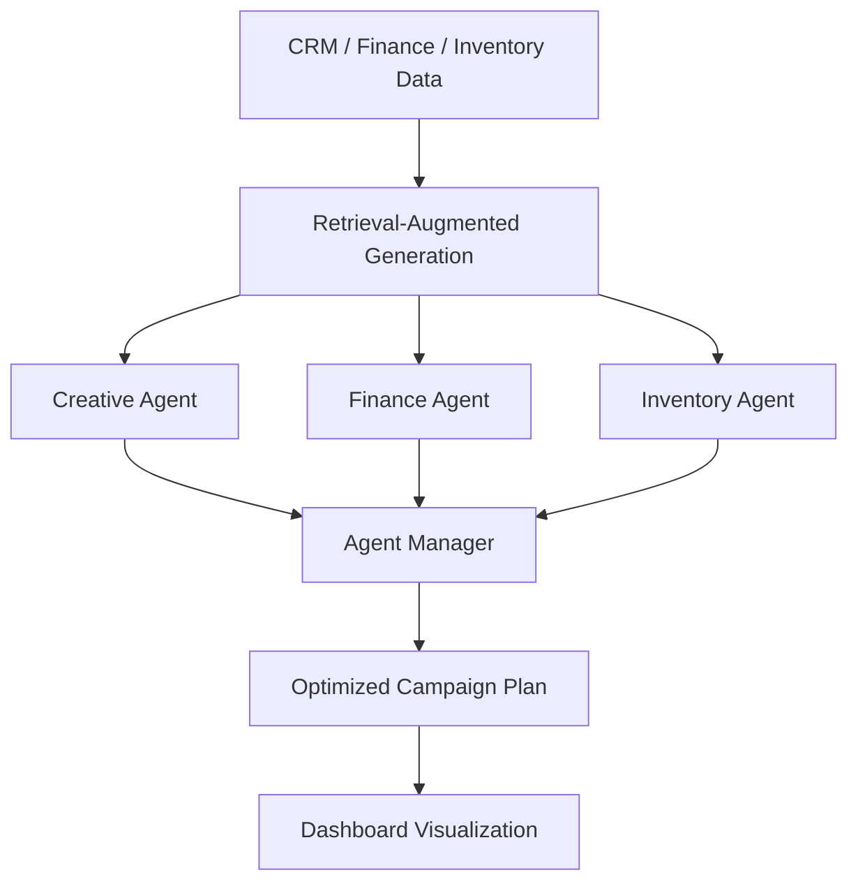

# 🚀 MarketBridge – AI-Driven Marketing Campaign Planner

**MarketBridge** is an intelligent multi-agent platform that automates marketing campaign planning by connecting marketing, finance, and inventory teams through autonomous AI agents.

Built with **React + Vite (Frontend)** and **Python (Backend)**, MarketBridge uses **Retrieval-Augmented Generation (RAG)** to access CRM, financial, and inventory data — helping businesses plan, optimize, and adapt campaigns in real time.

---

## 🧠 Overview

Planning a marketing campaign involves close coordination between:
- 🎨 **Marketing Teams** – for creative strategy and audience targeting  
- 💰 **Finance Teams** – for budgeting and ROI evaluation  
- 📦 **Inventory Teams** – for stock verification and supply management  

**MarketBridge** brings these roles together using **AI agents** that collaborate and negotiate autonomously to create optimized, data-driven campaign plans.

---

## ✨ Key Features

- 🤖 **Multi-Agent Collaboration**  
  - *Creative Agent* – Generates campaign concepts, creatives, and target segments.  
  - *Finance Agent* – Checks financial feasibility, ROI, and budget allocation.  
  - *Inventory Agent* – Validates product availability and stock distribution.  

- 🔁 **Adaptive Campaign Planning**  
  - Agents dynamically re-plan when budgets or inventory levels change.

- 💡 **RAG-Enhanced Intelligence**  
  - Integrates live CRM, finance, and inventory data for up-to-date decisions.

- 🧮 **What-If Simulations**  
  - Run hypothetical scenarios (discounts, budget shifts) and see instant projections.

- 🎨 **Modern UI/UX**  
  - Minimal, clean, and responsive — inspired by the sleek design of [Quiccle.com](https://quiccle.com).

- 📊 **Data Visualization Dashboard**  
  - View agent activity, campaign projections, and inventory insights in real time.

---

## ⚙️ Tech Stack

| Layer | Technologies |
|-------|---------------|
| 🖥️ Frontend | React 18, Vite, Tailwind CSS, Framer Motion |
| ⚙️ Backend | Python 3, Flask / FastAPI |
| 🤖 AI / LLM | Google Generative AI (Gemini API) |
| 💾 Data Handling | Retrieval-Augmented Generation (RAG) |
| ☁️ Deployment | Vercel / Render / Railway (optional) |

---

## 🧱 Folder Structure

```

MarketBridge/
│
├── frontend/
│   ├── src/
│   │   ├── components/     # UI components (Button, Card, Navbar)
│   │   ├── pages/          # Home, Dashboard, etc.
│   │   ├── styles/         # CSS / Tailwind styles
│   │   ├── App.jsx         # Main routes
│   │   └── main.jsx        # Vite entry point
│   └── package.json
│
├── backend/
│   ├── agents/             # Creative, Finance, Inventory agents
│   ├── agent_manager.py    # Agent coordination logic
│   ├── main.py             # Backend entry point
│   ├── requirements.txt
│   └── ...
│
└── README.md

````

---

## 🤝 Agent Workflow

1. 🎨 **Creative Agent** proposes campaign ideas and customer segments.  
2. 💰 **Finance Agent** validates budgets, discount levels, and ROI.  
3. 📦 **Inventory Agent** ensures product stock and availability.  
4. Agents **collaborate** and **negotiate** to create an optimized, feasible plan.  
5. The final campaign is displayed in the dashboard with data visualizations and insights.

---

## 🎨 UI/UX Highlights

> Inspired by the elegant and modern design of [Quiccle.com](https://quiccle.com)

- 🧭 Clean, minimal hero section: *“Plan Smarter. Launch Faster.”*  
- 🧩 Card-based dashboard showing agents and campaign metrics  
- 🌀 Smooth transitions using Framer Motion  
- 💻 Fully responsive for mobile and desktop  
- 🌗 Optional light/dark theme support  

### 🖼️ UI Preview

| Landing Page | Dashboard View |
|:-------------:|:--------------:|
|  |  |

---

## 💻 Installation and Setup

### 🔹 Frontend Setup

1. Clone the repository:
bash git clone https://github.com/Veins19/MarketBridge.git cd MarketBridge/frontend


2. Install dependencies:

   bash npm install
 
3. Start the development server:

   bash npm run dev
   

   Open [http://localhost:5173](http://localhost:5173)

---

### 🔹 Backend Setup

1. Create and activate a virtual environment:

   bash cd ../backendpython3 -m venv venv source venv/bin/activate

2. Install backend dependencies:

  bash pip install -r requirements.txt
   ```

3. Run the backend server:

   ```bash
   python main.py
   ```

   Backend runs on [http://localhost:5000](http://localhost:5000)

---

### 🔹 Environment Variables

**Frontend `.env`**

```
VITE_API_URL=http://localhost:5000
```

**Backend `.env`**

```
GOOGLE_API_KEY=your_google_generative_ai_key
```

---

## 🧩 How It Works



---

## 🔧 Troubleshooting

| Issue                            | Solution                                                    |
| -------------------------------- | ----------------------------------------------------------- |
| `npm: command not found`         | Install Node.js using `brew install node`                   |
| `ModuleNotFoundError: packaging` | Run `pip install packaging` inside your virtual environment |
| CORS Error                       | Add `flask-cors` or `FastAPI CORSMiddleware`                |
| Port already in use              | Change the port in `vite.config.js` or kill running process |
| Blank page                       | Check `.env` configuration and API URL                      |

---

## 🌟 Future Enhancements

* ⚡ Real-time agent collaboration using WebSockets
* 📈 Advanced analytics dashboard
* 💬 Agent conversation visualization
* 🧮 Budget optimization module
* 🔐 User authentication and role-based access

---

## 🤝 Contributing

We welcome contributions!

1. Fork the repository
2. Create a new branch

   ```bash
   git checkout -b feature/new-ui
   ```
3. Commit your changes

   ```bash
   git commit -m "Enhanced dashboard design"
   ```
4. Push your branch

   ```bash
   git push origin feature/new-ui
   ```
5. Submit a Pull Request 🎉

---

## 🧾 License

This project is licensed under the **MIT License**.
You are free to use, modify, and distribute it with attribution.

---

## 🧑‍💻 Credits

Developed by **Team Veins19**

* UI/UX design inspired by [Quiccle.com](https://quiccle.com)
* AI features powered by **Google Generative AI SDK**

---

## 🧠 Summary

| Category      | Description                               |
| ------------- | ----------------------------------------- |
| **Purpose**   | AI-driven marketing campaign automation   |
| **Frontend**  | React + Vite + Tailwind + Framer Motion   |
| **Backend**   | Python (Flask/FastAPI) multi-agent system |
| **AI Engine** | Google Generative AI (Gemini API)         |
| **Design**    | Clean, minimal Quiccle-inspired UI        |
| **License**   | MIT                                       |
| **Team**      | Veins19                                   |

---

### 💬 Final Note

> “**Plan Smarter. Launch Faster.**”
> MarketBridge empowers businesses to design and execute campaigns through intelligent, data-driven AI collaboration.

---

MarketBridge/README.md


---

Would you like me to generate the **frontend-only README.md** next (focused just on the React + Vite setup, with image placeholders and Tailwind instructions)? That helps when people open just the `/frontend` folder.
